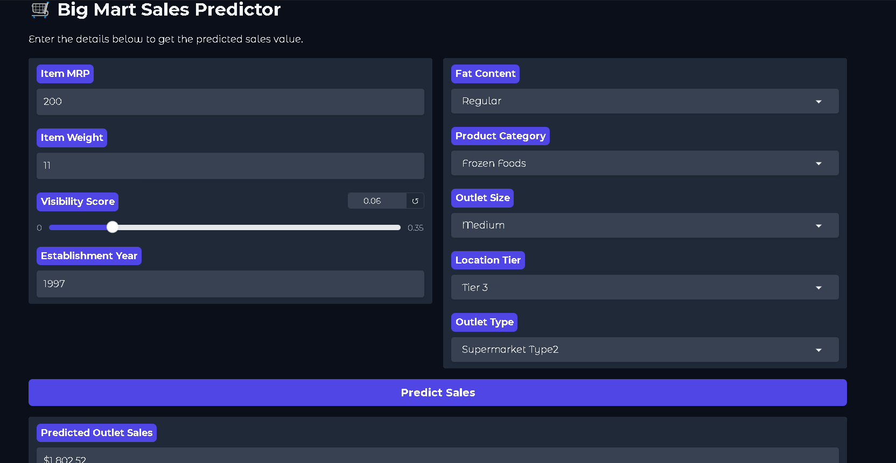
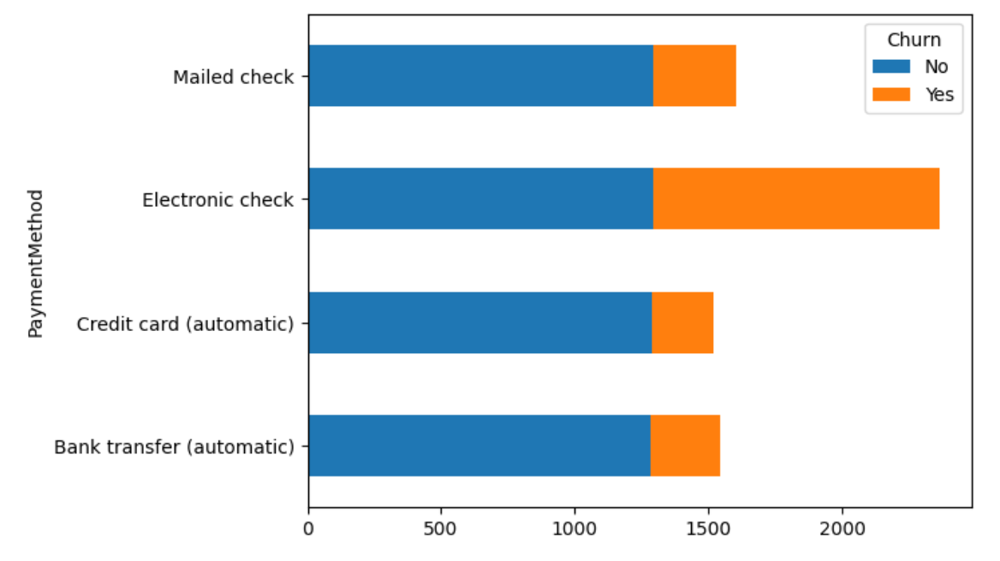

# **Machine Learning & Predictive Analytics Portfolio**

Welcome to my Machine Learning portfolio. This repository contains end-to-end projects ranging from retail sales forecasting to financial risk assessment, with a focus on production-ready pipelines and model interpretability.

---

##  Projects Overview

## 1. BigMart Sales Optimization (Regression & Deployment)
**Objective:** Forecast product sales for a retail giant to optimize supply chain management.
- **Tech Stack:** Python, Scikit-Learn, XGBoost, Joblib, Gradio.
- **Highlights:** - Built a robust **Preprocessing Pipeline** (imputation, encoding, scaling) to prevent data leakage.
    - Optimized an **XGBRegressor** using **GridSearchCV** with 8-fold cross-validation.
    - **Deployment:** Integrated the trained model into a live web app.
- ### [Live Demo on Hugging Face](https://huggingface.co/spaces/jawwad1234/Retail_Sales_Forecasting_Engine)
   

- 

Repository: [BigMartSalesPrediction](BigMartSalesPrediction)

---
## 2. Telco Customer Churn Prediction

**End-to-End Machine Learning Project**  
Predicting which customers are likely to churn (cancel their service) so the company can take preventive action.

### Business Problem
Customer churn is one of the biggest challenges for telecom companies. Losing a customer is much more expensive than retaining one. This model identifies high-risk customers early so targeted offers or improvements can be made.

### Key Steps & Approach
- Cleaned and preprocessed the Telco dataset (dropped irrelevant columns like `customerID` and `TotalCharges`)
- Handled categorical features with One-Hot Encoding and scaled numerical features
- Used **stratified train-test split** to keep class balance
- Focused on **Recall** (not just accuracy) because catching actual churners is more important than overall accuracy

### Models & Results

| Model                  | Test Accuracy | Recall   | ROC-AUC  | Notes |
|------------------------|---------------|----------|----------|-------|
| Logistic Regression    | **80.31%**    | 57.49%   | **83.36%** | Best overall performer |
| AdaBoost               | 79.39%        | 49.20%   | 83.97%   | Strong ROC-AUC |
| Decision Tree          | 78.32%        | 50.00%   | 81.98%   | - |
| Random Forest          | 78.04%        | 48.66%   | 81.42%   | - |

**Best Model:** Logistic Regression – Highest accuracy and strong ability to identify churners.
   

### Tech Stack
Python, Pandas, Scikit-learn, OneHotEncoder, StandardScaler

Repository: [Visit for more details](TelcoChurnPrediiction)

---

## 3. Credit Default Risk Prediction

**End-to-End Machine Learning Project**  
Predicting whether a credit card customer will default next month using the UCI Credit Card dataset.

### Business Problem
Banks lose huge amounts when customers default. This model helps identify high-risk customers **before** the next billing cycle so proactive steps can be taken.

### Key Challenges & How I Solved Them
- **Data Leakage**: The original dataset contained current-month features that indirectly revealed the target. I identified and removed them.
- **Time-aware Validation**: Used temporal split (older data for training, newer data for testing) instead of random split to simulate real-world conditions.
- **Model Comparison**: Started with Logistic Regression → Tuned Decision Tree → Random Forest.

### Models & Results
| Model                  | Test Accuracy | Notes |
|------------------------|---------------|-------|
| Logistic Regression    | ~79.5%        | Strong baseline after scaling |
| Decision Tree (max_depth=8) | ~80.0%   | Reduced overfitting |
| Random Forest (500 trees) | **80.5%**  | Best generalization & stability |

**Feature Importance:**  
Repayment history from the past 4–6 months (PAY_4, PAY_5, PAY_6) are by far the strongest predictors of default, followed by credit limit (LIMIT_BAL).  
   

### What I Delivered
- Proper feature engineering & scaling
- Leakage detection and removal
- Bias–variance analysis
- Business-focused insights

**Tech Stack**: Python, Pandas, Scikit-learn, Matplotlib

Repository [CredictDefault_repo](Credit%20Default)

---

##  Core Skills
* **Machine Learning:** Supervised Learning (Regression/Classification), Hyperparameter Tuning, Model Evaluation.
* **Engineering:** Scikit-Learn Pipelines, Model Serialization (Joblib), Version Control (Git).
* **Deployment:** Building Interactive ML Apps with Gradio & Hugging Face.
* **Data Analysis:** Exploratory Data Analysis (EDA), Feature Engineering, Data Cleaning.

---

## 📬 Contact
I am currently seeking **Machine Learning Internships** in Lahore. 
- **LinkedIn:** [www.linkedin.com/in/muhammad-jawwad-gul](LinkedIn)
- **Email:** jawwadgul12@gmail.com
